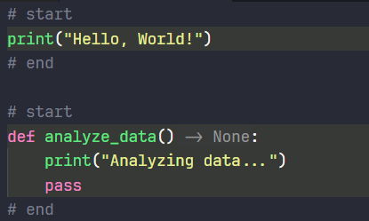

# Section Highlight Extension for VS Code


> Highlight and visually organize your code with customizable section markers in multiple languages.



## Features

- **Visual Organization** - Clearly distinguish different logical sections in your code
- **Multi-Language Support** - Works with JavaScript, TypeScript, C/C++, C#, Java, Python, HTML, XML, and SVG
- **Nested Sections** - Supports nested regions with different highlight colors
- **Customizable** - Configure colors, patterns, and language-specific settings
- **Performance Optimized** - Efficient debounced updates to keep your editor responsive

## Supported Comment Styles

| Language                                 | Start Pattern                                          | End Pattern                                             |
| ---------------------------------------- | ------------------------------------------------------ | ------------------------------------------------------- |
| JavaScript, TypeScript, C, C++, C#, Java | `// region` or `// SECTION: 📂 name begin`             | `// endregion` or `// SECTION: 🔚 name end`             |
| Python                                   | `# region` or `# SECTION: 📂 name begin`               | `# endregion` or `# SECTION: 🔚 name end`               |
| HTML, XML, SVG                           | `<!-- region -->` or `<!-- SECTION: 📂 name begin -->` | `<!-- endregion -->` or `<!-- SECTION: 🔚 name end -->` |

## Installation

1. Open VS Code
2. Go to Extensions (Ctrl+Shift+X)
3. Search for "Section Highlight"
4. Click Install

## Commands

- `Section Highlight: Toggle` - Enable or disable highlighting (Command Palette: `Ctrl+Shift+P`)

## Configuration

This extension can be customized through VS Code settings:

```json
"commentBlockHighlighter.enabled": true,
"commentBlockHighlighter.colors": [
  "rgba(255, 255, 64, 0.07)",
  "rgba(127, 255, 127, 0.07)",
  "rgba(255, 127, 255, 0.07)",
  "rgba(79, 236, 236, 0.07)"
],
"commentBlockHighlighter.includeStartEndLines": false,
"commentBlockHighlighter.excludedLanguages": [],
"commentBlockHighlighter.languagePatterns": {
  // Language-specific patterns
}
```
